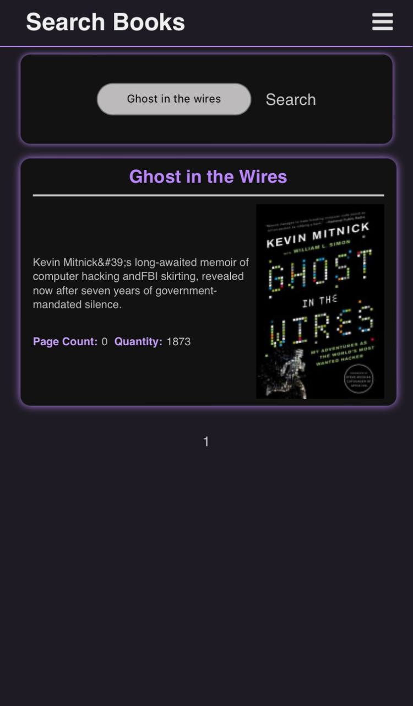
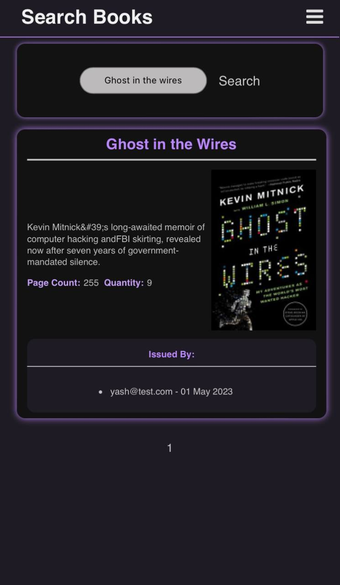
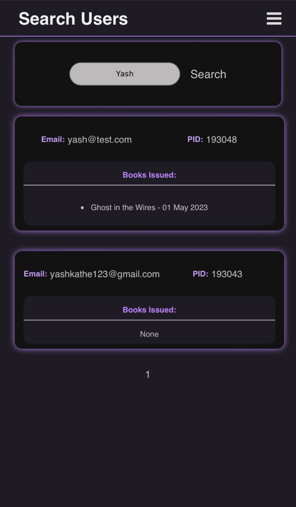
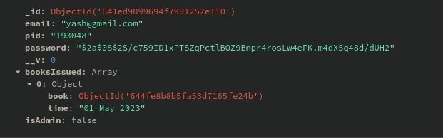
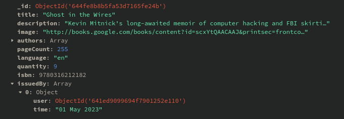

# Introduction

### The project _" library automation system "_ is divided in two repositoires 
1. [The Library System](https://github.com/yashkathe/Library-Automation-System)
2. [Library Portal](https://github.com/yashkathe/Library-Portal)

# Why Library Automation system ?

A library is a place of endless knowledge, offering a variety of resources for people of all ages. From classic literature and new fiction to educational materials and reference books, libraries provide an incredible wealth of information. It is a gateway to providing resources and services that shape new opportunities for learning and gaining knowledge. As managing a big traditional library could be a daunting task, we believe that our project would be an excellent way to reduce the interaction between the Library staff and the users and manage the task efficiently.   
Our project automates the task of issuing and returning books. It also helps to create a centralized system, portal and database for books, users and admins which assists the already existing system. A Raspberry Pi is used as the central hardware component where the database is maintained, the web server is hosted, as well as other necessary RFID scripts are running. The system is based on Admin-Client Interaction.  
Library Automation System is a technique of maintaining and surveying books at the Library so that books are distributed and managed effectively. Digitizing libraries can help retrieve books quickly, store large amounts of data, have a long operating life, and have a low-cost advantage. It is the information and scientific trend of book management. It also eliminates the need for security personnel by employing Radio Frequency Identification (RFID) technology

# UI - Client side

The student can issue the book from the library system and for that purpose, the login QR code must be scanned. After scanning the QR code the student gets logged in to the Library system portal. Figure 3.11 represents the QR code for the user. This QR code is unique to each individual student and works as an identification card or library card. Users require a QR code to log into the library system, which is created by encoding the ObjectId. The ’npm QR code’ library creates the QR code.

    

If the user has to return the books issued, he/she has to click return a book and then it gets directed to a page where all the books that are issued are displayed. The user has to select the book which he/she wants to return and click on Barcode for returning.

    

The book return QR code is shown below. Here the QR code value and the
book ISBN should match for successfully returning the book

    

The user can also search for various books that are available in the library. The student just has to type in the book name and hit enter.

    

# UI - Admin side

The Admin can search for various books by entering the book name. After that, the book data is displayed with the student’s name who has issued that book.

    

The Admin can also search various users by searching the user’s name. 
The Admin gets the student details and list of books issued by the user

    

# Database - MongoDB

### Student Schema

    

### Book Schema

    

# Extra 

Read more about the [main project](https://github.com/yashkathe/Library-Automation-System).